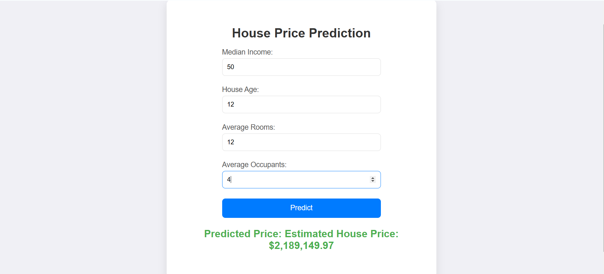

# House Price Prediction Using Flask & Machine Learning


## Overview
Welcome to the **House Price Prediction** project! This is a simple **Flask web application** that predicts house prices based on input features using a **Linear Regression model** trained on the **California Housing dataset**.

- **Model**: Linear Regression
- **Dataset**: California Housing dataset
- **Web Framework**: Flask
- **Features**: Predict house price based on `Median Income`, `House Age`, `Average Rooms`, and `Average Occupants`.

## Features
- **Live Prediction**: Users can input house features, and the application will predict the house price.
- **Real-time Input Validation**: Ensures that only numeric values are entered.
- **Interactive UI**: Dynamic design with a loading spinner, error messages, and a responsive layout.


## Installation Instructions
Follow these simple steps to set up the House Price Prediction application on your local machine:

1. **Clone the repository:**
   ```bash
   git clone https://github.com/yourusername/house-price-prediction.git
   cd house-price-prediction
   ```

2. **Install dependencies**:
   Create and activate a virtual environment, then install the required dependencies:
   ```bash
   pip install -r requirements.txt
   ```

3. **Train the model (if `model.pkl` is not available)**:
   Run the following command to train the model:
   ```bash
   python model/train_model.py
   ```
   This will generate the `model.pkl` file in the `model/` directory.

4. **Run the Flask application**:
   Start the Flask development server:
   ```bash
   python app.py
   ```
   Open your browser and navigate to:
   ```
   http://127.0.0.1:5000/
   ```

## Screenshots & Interactive Previews
Check out these screenshots and animated GIFs for a preview of the app!

### 1. Home Page (Input Form)



## How It Works
1. **User Input**: The user provides values for `Median Income`, `House Age`, `Average Rooms`, and `Average Occupants` via an intuitive input form.
2. **Prediction**: When the user submits the form, the Flask app processes the input, and the Linear Regression model predicts the house price.
3. **Result**: The predicted house price is displayed dynamically below the form with smooth transitions.

## Folder Structure
Here’s the folder structure of the project:

```
house-price-prediction/
├── app.py                # Main Flask application file
├── static/
│   ├── style.css         # CSS file for styling
├── templates/
│   ├── index.html        # HTML template for the prediction form
├── model/
│   ├── model.pkl         # Trained machine learning model
│   ├── train_model.py    # Script to train the model on the dataset
├── requirements.txt      # List of Python dependencies
├── screenshots/          # Folder to store screenshots for documentation
└── README.md             # Project documentation
```

